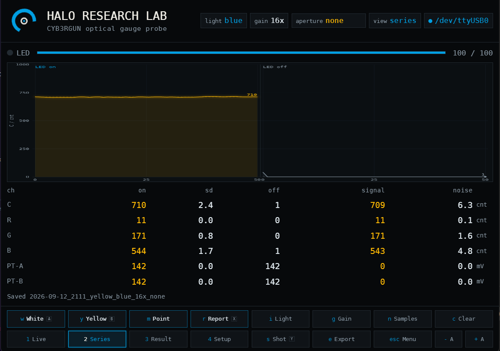

<p align="center">
  
</p>

<h1 align="center">halo-gauge-experiment</h1>

<p align="center">
  <strong>Reading an analog pressure gauge optically, from the outside, without touching it.</strong><br>
  A ring of cent-priced sensors, blue light, and the shadow of a needle.
  Open research, including the measurements that failed.
</p>

<p align="center">
  <a href="LICENSE.md"></a>
  <a href="LICENSE.md"></a>
  <a href="LICENSE.md"></a>
  <a href="#where-this-stands"></a>
  <a href="#the-probe"></a>
  <a href="docs/research/prior-art.md"></a>
</p>

---

The pressure gauge on a pre-charged pneumatic airgun sits inside a sealed,
type-approved system. Screwing in an electronic transducer means opening that
system, which for a gauge under German F-mark approval is not an option for the
owner and elsewhere is at best unwise.

So the needle is read from outside, through the glass, with the original gauge
left exactly as it is. Once the value is digital it can be displayed anywhere,
logged over time, compared against shot data, or fed into a head-up display.

This repository holds the whole thing: the printable test fixture, the probe
firmware, the measurement software, the raw data, and the five versions of the
fixture that were thrown away before the sixth worked.

---

## The Idea

Yellow absorbs blue. Under blue light a yellow needle is dark and a white dial
is bright, and the difference is large enough for a phototransistor that costs
thirty cents.

| | conventional approach | this approach |
|:--|:--|:--|
| **Sensor** | camera plus image processing | 16 to 37 phototransistors in an arc |
| **Contrast from** | ambient light and luck | illumination chosen against the needle pigment |
| **Power** | milliwatts, continuously | microwatts, emitter pulsed per reading |
| **Build height** | needs working distance for optics | under 10 mm over the glass |
| **Smallest dial** | 38 mm commercially | 20 mm |
| **Resolution** | pixels | ratio between two neighbouring sensors |

No image, no inference, no working distance. The pattern of light and dark
across the arc says where the needle is, and the ratio between two adjacent
sensors gives the position between them.

---

## Where This Stands

| Stage | Question | State |
|:--|:--|:--|
| **0** | Is the colour contrast large enough at all | **passed** |
| **0b** | Does the thirty-cent phototransistor see it too | **passed** |
| **0c** | Is blue the reason, or merely brightness | white emitter on order |
| **1** | How does one sensor see the needle sweep past | cards printed, fixture ready |
| **2** | Can two sensors interpolate the position between them | next |
| **3** | Does it survive the glass of a real gauge | after stage 2 |

### Stage 0 Result

Blue emitter, a white card against a card in the needle colour, ambient removed
by sampling with the emitter on and off. The threshold was fixed at an SNR of
10 **before** the first measurement.

| Sensor | White | Yellow | Ratio | Contrast | SNR |
|:--|--:|--:|--:|--:|--:|
| TCS34725, clear | 1068 cnt | 224 cnt | 4.8 | 79 % | 22 |
| TCS34725, blue | 828 cnt | 168 cnt | 4.9 | 80 % | 22 |
| ALS-PT19 | 2286 mV | 451 mV | 5.1 | 86 % | 160 |

Two independent sensors agree on a factor of five. With the emitter dark both
read exactly zero, which is also the proof that the chamber is light tight.

Raw output of every run, including the ones that went wrong, is in
[`docs/log/data/`](docs/log/data).

---

## Why It Matters Beyond One Gauge

Every PCP airgun has the same problem: a small dial, a coloured needle, a
housing nobody may open. What differs between a Huben, an Evanix, a Daystate or
an FX is dial diameter, sweep angle and needle colour.

All three are parameters, not redesigns, and the software treats them as
parameters from the first line. Enter a gauge, set a range and a step, and the
measurement plan, the file names and the printable test cards follow.

**The same method applies wherever a sealed instrument has to stay sealed.**
Diving cylinders, compressors, workshop manometers, breathing apparatus. The
one published patent closest to this project is for the pressure gauge of an
air respirator, for exactly that reason.

---

## The Fixture

A reflectance test bench in black PLA, for under 60 euro in parts.

| | |
|:--|:--|
| **Geometry** | 20/0. Emitter at twenty degrees, sensor looking straight down. Colour measurement normally uses 45/0, but under ten millimetres of build height there is no room for forty-five, and the ring will have the same constraint. |
| **Chamber** | closed box standing on the card. Emitter dark reads 0.00 counts. |
| **Field stop** | exchangeable card with a pierced hole. Printed holes below 1.5 mm do not exist after printing, which is why the aperture left the printer. |
| **Sensor pocket** | takes either sensor, so nothing but the sensor changes between two runs. |

This is **not** a spectrophotometer. Such an instrument measures absolutely and
calibrated, costs five figures, and measures under its own illumination. This
one measures relatively, white against yellow, under exactly the light source
and geometry the product will use. For this question that is the more relevant
number. For a colour standard it would be nonsense.

Parts, orientation and print settings: [`hardware/jig/README.md`](hardware/jig/README.md)
Method, wiring and evaluation: [`docs/method/measurement.md`](docs/method/measurement.md)
Six versions and why five were scrapped: [`docs/log/jig-versions.md`](docs/log/jig-versions.md)

---

## The Probe

A Heltec WiFi LoRa 32 V2 carrying a TCS34725 colour sensor and two ALS-PT19
phototransistors. It samples N times with the emitter on and N with it off,
returns mean and standard deviation per channel, and computes nothing else:
every number in this repository comes from the raw data, not from the firmware.

It speaks the same protocol over USB and over TCP, so the cable to the bench
computer can be pulled off, and it updates itself over WiFi, so the fixture can
be screwed shut for good.

```
w   white card        i   switch emitter, blue or white
y   yellow card       g   cycle colour sensor gain
m   one needle position, labelled by the software
n   samples per half series, 10 / 25 / 50 / 100
r   report contrast and SNR
```

---

## HALO LAB

<p align="center">
  
</p>

The measurement front end. It reads the probe, shows the running series full
screen, and files every result three ways: a readable text record, the raw
JSON, and a row in an SQLite database. Gauges, campaigns and needle positions
are managed in the app, and the measurement plan is computed from the range and
the step size.

It runs as a self-contained instrument on a Clockwork uConsole, which boots
straight into it with no desktop in sight, and equally on any PC.

```bash
python3 software/labui/halo_lab.py --port /dev/ttyUSB0
# then open http://127.0.0.1:8760
```

Details: [`software/labui/README.md`](software/labui/README.md) and
[`software/launcher/README.md`](software/launcher/README.md)

---

## Getting Started

### 1. Print the fixture

Eleven parts, black PLA, 0.20 mm, no supports. See
[`hardware/jig/README.md`](hardware/jig/README.md) for orientation, which is
the part that is easy to get wrong.

### 2. Print the cards

```bash
python3 tools/make_cards.py --scale 3 --from 16 --to 24 --step 0.5 --show-radius
```

At 100 %, no scaling. Every sheet carries a ruler so a wrongly scaled print is
obvious before it is measured.

### 3. Wire and flash

Wiring table in [`docs/method/measurement.md`](docs/method/measurement.md).
Open [`firmware/halo_gauge_probe/`](firmware/halo_gauge_probe) in the Arduino
IDE, board **Heltec WiFi LoRa 32(V2)**, upload.

### 4. Measure

```bash
pip3 install pyserial
python3 software/labui/halo_lab.py --port COM6
```

White card, yellow card, report. Twenty seconds each.

---

## Contributing

**The most useful contribution is a measurement on a gauge this project has not
seen.** Another needle colour, another dial size, another manufacturer. If the
method holds across gauges, everything after it is calibration.

Negative results are wanted as much as positive ones. A gauge where this does
not work is worth more than a third one where it does.

Two house rules: measurements over opinions, and failures stay in the log.
[`CONTRIBUTING.md`](CONTRIBUTING.md)

---

## Prior Art

This is not the first optical gauge reader and does not pretend to be.

| | |
|:--|:--|
| **BAM, 2006** | reflective light barriers in a ring around a pointer axis, WO 2007/147609 |
| **Cypress Envirosystems, 2008** | clip-on camera reader, 38 to 114 mm dials, plus or minus 1.5 % of full scale |
| **Siemens, 2019** | patented sensor ring with triangular elements, active until 2040 |
| **AI-on-the-edge-device, 2020** | ESP32-CAM with TensorFlow Lite, the open source camera route |

What is new here: the wavelength chosen against the needle pigment, a 20 mm
dial, and published measurements. The delineation from the Siemens claim is
deliberate and documented, down to the design rule that follows from it.

Sources and the full review: [`docs/research/prior-art.md`](docs/research/prior-art.md)

---

## Repository

```
docs/research/      prior art: patents, commercial devices, open source
docs/method/        how the measurement is done and evaluated
docs/log/           build log, discarded versions, raw data
hardware/jig/       printable fixture, bill of materials, print settings
hardware/cards/     printable test cards
tools/              card generator for any dial, range, sweep and scale
firmware/           probe firmware for a Heltec WiFi LoRa 32 V2
software/labui/     HALO LAB, the measurement front end
software/launcher/  the terminal it runs on
```

---

## Licence

| What | Where | Licence |
|:--|:--|:--|
| Firmware, software, tools | `firmware/`, `software/`, `tools/` | **GPL-3.0-only** |
| Hardware, printable parts, card artwork | `hardware/` | **CERN-OHL-S-2.0** |
| Documentation and measurement data | `docs/`, `README.md` | **CC-BY-SA-4.0** |

Build it, change it, sell it. Keep the notice, say what you changed, pass the
same freedom on. Full text and the reasoning: [`LICENSE.md`](LICENSE.md)

---

## Origin and Trademarks

This project started inside the CYB3RGUN development and is published as a
standalone community project.

Huben, GK1 and any other manufacturer or product names are trademarks of their
respective owners. This project is not affiliated with or endorsed by any of
them. The test dials in this repository are original artwork and not copies of
any manufacturer's dial: only the geometry follows a real gauge, and geometry
is technical, not protectable.

<p align="center">
  <sub>Sascha Dämgen, 2026. Measured, not assumed.</sub>
</p>
